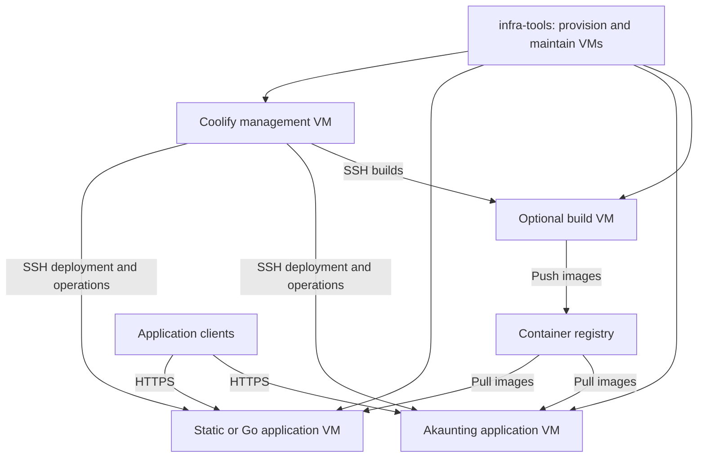

# Coolify integration and application platform evaluation

Status: deferred decision, 2026-09-07. Infra-tools will not integrate Coolify
or make it a dependency at this time. No Coolify integration or Akaunting
support is implemented by this plan. Revisit only when a concrete complex
application need justifies an optional platform evaluation.

## Recommendation and constraints

Do not pilot or adopt Coolify as part of the current roadmap. Keep infra-tools
usable with only its lightweight controller, saved configuration, and SSH
access. Native deployment and CI/CD remain the supported path for simple
applications. A future, separately managed Coolify installation may still be
used for a particularly complex application, but it must remain optional and
isolated from the control system.

Do not make Coolify a required service, Docker dependency, database, or API for
the infra-tools controller. Avoid building a second Compose manager, mirroring
the Coolify UI, or translating every `infra.json` feature into Coolify. Continue
reliability work on the native deployment path.

Infra-tools and its management platform must remain FOSS. Source-available
applications may be supported separately. Coolify's current repository license
is Apache-2.0; retain the license from the exact release selected for the pilot.
Self-hosting must not require a proprietary management service. Registry, Git,
and backup choices should also permit a fully FOSS, self-hosted deployment.
[Coolify license](https://github.com/coollabsio/coolify/blob/main/LICENSE).

This is a separate container application track. The PHP exclusion and native
binary preference in [lightweight service candidates](LIGHTWEIGHT_SERVICE_CANDIDATES.md)
still govern that native-service project. Akaunting evaluation does not imply
adding host PHP-FPM, Composer, or a general native PHP installer.

## Current overlap and proposed disposition

The current contracts are [deployments](../DEPLOYMENTS.md),
[deployment safety](../DEPLOYMENT_SAFETY.md), [CI/CD](../CICD.md),
[backups](../BACKUPS.md), and the [web panel](../WEB_PANEL.md).

| Existing responsibility | Proposed owner for migrated applications | Work retained or changed |
| --- | --- | --- |
| `--cicd` receiver, queue, executor, repository scripts | Coolify deployment integration; build tests in external CI or a required build stage | Preserve commit identity and test gating; retire old webhook jobs after cutover. |
| `--build-server`, rsync artifact delivery | Container build pipeline and registry | Push immutable images; app servers pull them. Qualify separate builds for each selected resource type. |
| `--app-server`, `--deploy`, release directories and systemd units | Coolify containers | Existing native applications remain supported until individually migrated. |
| `infra.json` application model | Dockerfile/Compose for migrated applications | Keep app-specific recovery documentation and inventory references; do not require dual declarations of topology. |
| Generated application Nginx and Certbot configuration | Coolify proxy and certificate management | One owner per endpoint and host role; private TLS and tunnel behavior need explicit qualification. |
| Panel service links and machine maintenance | infra-tools, linking to Coolify for app operations | Current panel has no general app deployment UI or arbitrary service controller to replace. |
| Proxmox, disks, mounts, host access, network policy, OS maintenance | infra-tools | Preserve capability checks, validation, dry runs, and host recovery. |
| Application initialization, readiness, migrations, backup consistency | Tested application support recipe | Coolify operates the stack; the recipe defines what safe operation means. |
| Database backups, volume recovery, VM backups | Coordinated application recipe plus infra-tools infrastructure backup workflows | Qualify actual database coverage; restore data and matching application versions together. |

Coolify documents source builds, Dockerfiles, images, static applications, and
Compose support. These are deployment facilities, not evidence that an
arbitrary application's tests, migrations, or restoration are correct.
[Application options](https://coolify.io/docs/applications).

## Compare the options

These are engineering estimates of relative work, not measured staffing or
cost forecasts. Measure operational effort during the pilot before assigning
calendar estimates.

| Dimension | Continue native DIY | Add a DIY Compose manager | Integrate Coolify |
| --- | --- | --- | --- |
| Simple static/Go workloads | Strong existing fit; little migration work | Container packaging adds work | Container packaging and new control plane add overhead |
| Akaunting and multi-service apps | New runtime, DB, scheduler, migration and upgrade lifecycle | Compose handles topology; we still build deployment operations | Existing container operations; app qualification still ours |
| CI/CD investment | Finish shared manifest engine, queue behavior, delivery and diagnostics | Also add image/registry workflows and Compose activation | Configure upstream integrations; retain test/build pipeline where needed |
| Routing, TLS, operational UI | Continue maintaining our implementations | Expand our integrations and UI | Delegate application operations to upstream |
| Safety and recovery | Preserve existing native guarantees; extend them ourselves | Define container failure and recovery behavior from scratch | Verify behavior; fill app-specific gaps without assuming parity |
| Authority | Restricted artifact push and dedicated native service users | Docker management adds host-level authority | Central manager has broad authority across its application VMs |
| Ongoing burden | Smaller dependencies, larger custom deployment codebase | Largest combined platform scope | Upstream upgrades, compatibility checks, control-plane recovery and registry operations |
| Portability | Tied to native manifest/runtime contract | Standard Compose plus our conventions | Dockerfile/Compose portable in principle; export secrets, volumes and proxy settings explicitly |

Prefer Coolify if it can replace the overlapping work without requiring a
substantial orchestration layer of our own. Keep native deployment as the
bounded alternative if the operational burden or loss of required guarantees
outweighs that reduction. A DIY Compose manager is a fallback only after a
specific unresolved requirement is demonstrated; it is not the default next
project.

## Ownership and topology

Coolify documents independent proxies on remote servers: application requests
go directly to the application VM, not through the management VM. The manager
uses SSH and the remote hosts require Docker. This fits the dedicated-VM
model, but continued serving during a management outage remains a pilot test.
[Server architecture](https://coolify.io/docs/knowledge-base/server/introduction).

Proposed ownership rules:

- Infra-tools declares VM resources, storage mounts, network reachability and
  maintenance policy. Coolify owns deployment resources, containers, networks
  within its stacks, and application ingress configuration.
- Establish one Docker installation/update owner. Initially follow the
  supported Coolify prerequisite flow; infra-tools coordinates host package
  maintenance and reboots around it. Do not add competing Docker installers or
  cleanup timers. Verify what ordinary saved-configuration reruns actually do.
- Do not combine a Coolify application-host role with native `--deploy`,
  `--app-server`, `--build-server`, or `--cicd` on the same VM. Proposed role
  validation must reject conflicts before remote mutation. Cross-fleet
  coexistence is expected during migration.
- Reserve application ports 80/443 for Coolify's proxy. If a machine panel is
  needed, qualify a separate management listener and inspect all generated
  Nginx listeners; changing just the advertised panel port is insufficient.
- Use Traefik for the first pilot, following Coolify's default. Test internal
  domains, private CA trust or ACME validation, and any Cloudflare tunnel path
  separately. Existing infra-tools certificate and ingress settings do not
  transfer automatically. [Proxy documentation](https://coolify.io/docs/knowledge-base/server/proxies).
- Restrict management UI/API and SSH reachability to management sources;
  expose only the intended application ingress. Do not publish database ports.
  Verify Docker port exposure from outside the VM, including IPv6 where
  enabled; host UFW rules alone are not proof of container isolation.
  [Firewall guidance](https://coolify.io/docs/knowledge-base/server/firewall).

Coolify build servers require registry access and matching architecture with
deployment servers. Its docs also distinguish build-only servers from app
servers. Test resource-specific support, especially Compose builds, instead
of assuming the native build/app flags have direct equivalents. An external
CI pipeline that tests and pushes images is an acceptable baseline.
[Build servers](https://coolify.io/docs/knowledge-base/server/build-server).

## Integration scope after the manual pilot

Start with a documented manual Coolify setup on infra-tools-provisioned VMs.
Only automate the steps that the pilot proves necessary and repeatable.
The following interfaces are design proposals, not existing CLI options:

1. **Host role and ownership record.** Record management/application/build role,
   management endpoint, server/resource identifiers, storage ownership and
   credential references. Keep raw credentials out of saved setup JSON.
2. **Provisioning boundary.** Put target setup in an owning package and select
   it through `plugins/`; retain `remote_setup.py` as the target mutation
   boundary. Review `plugins/web.py` because existing web capabilities append
   Nginx, native app-server and CI/CD steps. Do not treat Coolify as another
   application installed after those steps.
3. **Read-only connection and status.** Validate endpoint TLS, identity and
   supported version; discover an existing server/resource and link its UI.
   Report unavailable or stale observations explicitly. Start without a token
   that exposes environment values, private keys or sensitive logs.
4. **Small API adapter, if justified.** Use supported APIs for registration and
   deployment requests; never edit Coolify's database or generated Compose
   files. Persist resource IDs, inspect before create, and reconcile ambiguous
   timeouts before retrying. A queued deployment is not success: observe its
   terminal state and application readiness. Repeated provisioning must not
   create duplicate resources or regenerate secrets.
5. **Explicit ownership handoff.** Native deploy/redeploy commands must reject
   Coolify-owned targets or deliberately route through a documented backend;
   they must never silently run the native path. UI edits to Coolify-owned
   configuration are not drift for infra-tools to overwrite.

The current API documents team-scoped bearer tokens and separate read, deploy,
write and sensitive-read permissions. Confirm the selected release's actual
endpoints and permission enforcement before implementing an adapter; do not
assume resource-level isolation from team scoping. Keep the adapter bounded,
redact responses and errors, and handle rate limits and expired credentials.
[API authorization](https://coolify.io/docs/api-reference/authorization).

Use a dedicated Coolify SSH identity, preserve independently verified host
identities, and test host-key changes and key rotation. Docker-management
authority is materially broader than today's restricted rsync deployment
account. Do not put untrusted pull-request builds or production secrets on the
management VM; isolate build execution and restrict registry credentials to
the needed push/pull scope. Keep tests in required build stages or external CI,
and deploy the exact tested revision/image digest. A successful Git webhook
delivery alone must not authorize deployment of an untested later branch head.

## Akaunting qualification

Use synthetic accounting data. Do not assume a one-click template exists or
that an upstream Compose example is a production support contract.

The official example combines Akaunting and MariaDB, mounts the entire
`/var/www/html` application tree, and uses unpinned image references. Therefore
an image change alone cannot be assumed to update the persisted application
files. Review the selected image's entrypoint and upgrade mechanism; record
the effective application version before and after an update.
[Upstream Compose](https://github.com/akaunting/docker/blob/master/docker-compose.yml).

The Docker instructions use `AKAUNTING_SETUP=true` for initial setup and warn
against reusing it afterward. They also offer several runtime/worker variants.
The support recipe must prove initialization is one-time, preserves secrets,
and cannot reset an existing installation during reconciliation.
[Docker instructions](https://github.com/akaunting/docker/blob/master/README.md).

The Docker README's GPL claim differs from the application's current BSL-1.1
license. Treat the actual selected application release and add-ons separately:
record their licenses and required entitlements. Current application terms
limit the production-use grant, including user/company/invoice counts and
accounting-service use. Source availability is not an assurance that the
intended business workflow is included without a commercial license.
[Application license](https://github.com/akaunting/akaunting/blob/master/LICENSE.txt).

Before declaring support, deliver a versioned application recipe containing:

| Area | Required evidence |
| --- | --- |
| Packaging | Exact source revisions, image digests, architecture, supported DB version, and verified application version; avoid mutable `latest` for qualified releases |
| Topology | Web and DB services; explicitly decide whether this version/workflow needs scheduler, workers or Redis and which process runs each |
| First run | Private setup access, one-time initialization, administrator handoff, durable application key and DB credentials, and installer disabled afterward |
| Readiness | DB availability plus application-level login/read/write checks; dependency startup ordering alone is insufficient |
| Business smoke | Create a company, customer, invoice and attachment; exercise required scheduled/queued work and capture expected results |
| Updates | Supported upgrade sequence, DB migration ordering, worker pause/resume, maintenance window, and failure behavior for persisted application code |
| Recovery | Consistent DB and file capture, secrets/key recovery, version mapping, and restore to a new VM with checks of the recorded business data |

Prefer standard Compose plus clearly documented Coolify-specific settings.
Coolify can add configuration around Compose; raw mode is also available.
Export the effective domains, environment references, mounts and settings so
that leaving Coolify is testable. Do not infer atomic multi-service rollback
from Compose health checks. [Compose integration](https://coolify.io/docs/knowledge-base/docker/compose).

## Recovery contract

Coolify's database backup page describes database-specific commands and S3
destinations, but does not establish complete backup coverage for arbitrary
Compose databases and application files. Verify scheduling, retention,
failure alerts and restoration for the selected MariaDB resource. If coverage
is missing, the application recipe must own coordinated capture before
production adoption. [Database backups](https://coolify.io/docs/databases/backups).

Maintain three distinct recovery sets:

1. **Application:** quiesce web writes and workers, capture a consistent DB
   backup and matching files, record image/application/DB versions and required
   secret references, then resume and verify. Keep independent retained copies
   off-host and test restoration. Define RPO and RTO from business needs before
   production; record measured pilot loss window and restore time.
2. **Management:** preserve Coolify's database, encryption `APP_KEY`, SSH keys
   and required configuration securely. The upstream recovery guide explicitly
   excludes application volume data. Test a fresh management VM restore and
   reconnection without recreating or redeploying working app stacks.
   [Management backup and restore](https://coolify.io/docs/knowledge-base/how-to/backup-restore-coolify).
3. **Infrastructure:** retain VM configuration, disk/mount layout, network/DNS
   intent and Proxmox backups. Verify every state-bearing disk is included.
   A VM snapshot is not automatically an application-consistent backup.

Existing `--backup` jobs are mirrors, not retained consistent database
snapshots. Use them to transfer completed recovery archives where appropriate,
not to copy live MariaDB storage as the only backup. Image rollback cannot
reverse a database migration; restore matching state or use an explicitly
supported forward repair. Application and platform updates need separate
maintenance and recovery procedures.

## Future evaluation boundary

No pilot or live provisioning is planned. If this decision is revisited,
execute the evaluation as a separate project using disposable VMs and
synthetic data; do not add Coolify to the core setup path first.

| Phase | Deliverable | Exit gate |
| --- | --- | --- |
| 0. Pin and design | Record Coolify release, Docker/Compose versions, guest OS, architectures, Akaunting/image/DB versions, license evidence, VM sizing, registry and ingress design | A concrete application need exists and the optional boundary is documented |
| 1. Establish platform | Management VM plus two application VMs; manual onboarding, access policy and storage layout | Host rerun and reboot preserve Coolify; only intended ports reachable; credentials recoverable |
| 2. Stateless comparison | Same static/Go project deployed through native and Coolify paths on disposable targets; tested immutable image delivery | Successful update, build/test failure and health failure have understood outcomes; measure operator steps, downtime and resource use |
| 3. Stateful qualification | Akaunting recipe and repeatable first-run/update/recovery procedures | Business smoke survives update and clean-VM restoration; setup flag cannot recur; DB/files/version consistency demonstrated |
| 4. Failure and exit drills | Completed matrix below with logs, versions and observed behavior | Required guarantees met or deviations explicitly accepted; no unresolved data-loss or exposure failure |
| 5. Adoption decision | Decision record and bounded implementation backlog | Choose adopt, narrower trial, or stop; name the old functionality that can actually be retired |

For each drill record procedure, expected result, observed result, recovery
steps, elapsed time and evidence location. Mark unrun drills as unverified.

| Drill | Required result |
| --- | --- |
| Git event, failed tests, rapid successive commits, duplicate triggers | Only the tested revision is promoted; ordering and duplicate behavior are understood; failures are visible |
| Failed image pull/build, readiness failure, partial Compose start | No false success; existing service impact measured; documented recovery returns the stack to a known version |
| Failed DB migration or application-file upgrade | Maintenance state is visible; tested restore/forward repair restores business data; no blind image downgrade |
| App reboot, management outage, management rebuild | Restart behavior verified; app traffic tested during outage; management recovery restores access without losing app state |
| Missing data mount, full disk, unavailable registry or backup destination | Fail visibly without initializing replacement empty state; recover without deleting retained images/data |
| Backup and restore to a fresh VM | Company, invoice, attachments, secrets and required jobs verified; retention and backup-failure alert exercised |
| SSH identity change, token expiry/revocation, secret rotation | Expected failures and recovery are clear; no credential disclosure in logs or saved inventory |
| Docker cleanup, host maintenance, Coolify upgrade | Required volumes and recovery images survive; controlled restart and post-update checks work |
| Move stack away from Coolify | Restore with documented Compose/settings on an isolated Docker host; no hidden dependency on the old control plane |

If revisited, adopt only if representative applications pass their required
drills, the platform remains FOSS, and the measured administration plus
integration work is preferable to maintaining the native platform. Do not
require identical zero-downtime semantics where a documented maintenance
window is acceptable, but never silently weaken recovery or test gating.

## Migration and retirement

Migrate per application onto a fresh VM. Capture the existing manifest,
domains, health checks, state paths, secrets and backups; map each to its new
owner. Rehearse restoration before the cutover. Pause old deployment triggers
and application writers, take a final consistent recovery set, import it,
validate the new stack, then switch ingress and enable its single deployment
trigger. Retain the old VM inactive for the agreed recovery window.

If cutover fails before new writes, return ingress to the validated old stack.
After new writes, restoring old data can lose transactions: quiesce the new
stack and use the rehearsed data recovery/forward repair procedure. Never
allow two active accounting instances to write divergent production data.

Remove migrated repository entries, webhook credentials, restricted deploy
keys, obsolete Nginx/certificate jobs and release cleanup jobs only after the
recovery window and verification. Remove shared executor/build-server code
only when no saved configuration or application still needs it; update callers,
tests, CLI references and migration documentation together. Do not keep two
active deployment paths for the same application.

The [CI/CD manifest reuse plan](CICD_MANIFEST_REUSE.md) becomes the native-path
alternative pending this evaluation. Generic setup reliability, host identity,
secret safety and recovery work remain useful regardless of platform choice.
No existing feature is deprecated by this proposal alone.
